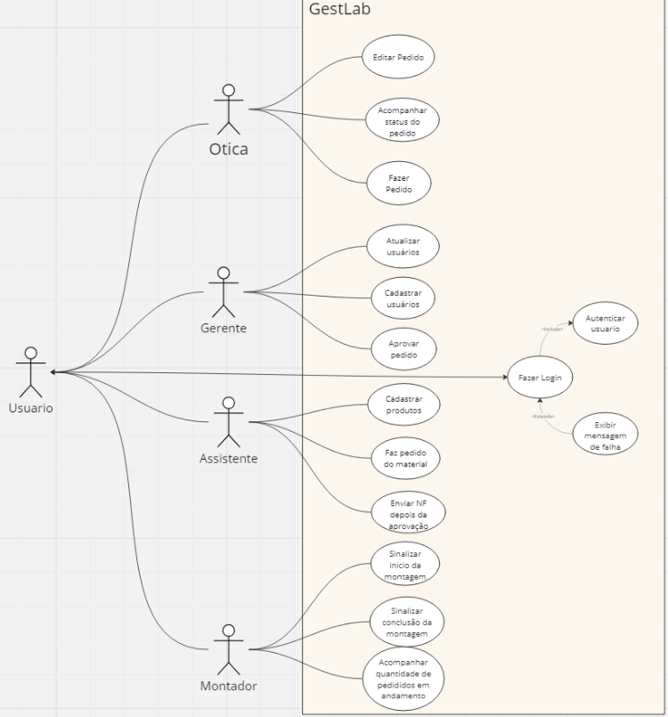

# Especificações do Projeto

As especificações do projeto se referem aos detalhes técnicos, funcionais e operacionais que devem ser atendidos pela aplicação de TI. Essas especificações servem como um guia para o desenvolvimento da solução, garantindo que ela atenda às necessidades e requisitos do usuário final. 

## Personas
As personas levantadas durante o processo de entendimento do problema são apresentadas na Figuras que se seguem.

### Antônia Tamires Silva de Carvalho
Idade: 34 anos
Cargo/ Função: Gerente do laboratório 

Escolaridade: Superior

Descrição da sua ocupação: A gerente é responsável pela supervisão geral das operações do laboratório de montagem de óculos. Toma decisões estratégicas relacionadas à produção, recursos humanos, finanças e estratégias de negócios.
Monitora o desempenho operacional e financeiro do laboratório. Define metas e objetivos de produção, qualidade e eficiência. Utiliza o aplicativo para acessar dados e relatórios de desempenho, aprovar os pedidos feitos pela óticas, realizar análises e tomar decisões estratégicas para otimizar os processos de produção.

### Marcela Lima
Idade: 2 anos
Cargo/ Função: Assistente administrativo 

Escolaridade: Superior Completo

Descrição da sua ocupação:  A assistente administrativa oferece suporte administrativo e logístico às operações do laboratório. É responsável pelo agendamento de pedidos, gerenciamento de estoque e comunicação com fornecedores. Auxilia na emissão de documentos, como faturas, ordens de compra e relatórios de produção. Utiliza o aplicativo para registrar estoque, verificar o status de entregas, gerenciar inventário e manter registros atualizados.

### Wanderson Rodrigo Pinheiro
Idade: 19 anos
Cargo/ Função: Montador

Escolaridade: Superior Incompleto

Descrição da sua ocupação: O montador é responsável pela montagem física dos óculos de acordo com as especificações e padrões estabelecidos. Realiza tarefas como encaixe de lentes nas armações, ajustes de tamanho e montagem de componentes adicionais.
Garante a qualidade e precisão do produto final, seguindo procedimentos e padrões de controle de qualidade. Utiliza o aplicativo para receber instruções de montagem, registrar o progresso do trabalho e reportar eventuais problemas ou defeitos identificados durante o processos.

### Ótica (cliente)
Cargo/ Função: cliente que solicita o pedido de montagem dos óculos

Descrição da sua ocupação: A óptica representa o cliente externo que solicita a realização dos óculos ao laboratório de montagem, pode ser um profissional independente que possui uma óptica ou uma loja de varejo de produtos ópticos.
Ele fornece as especificações do pedido, incluindo informações sobre a prescrição do cliente, tipo de lente, tratamentos desejados e preferências de armação. Espera uma comunicação clara e eficiente com o laboratório para acompanhar o status do pedido, fazer ajustes quando necessário e garantir a entrega dentro do prazo. Utiliza o aplicativo para enviar e acompanhar pedidos, verificar o status de produção, comunicar-se com o laboratório e garantir a satisfação do cliente final.

## Histórias de Usuários

Com base na análise das personas forma identificadas as seguintes histórias de usuários:

|EU COMO... `PERSONA`| QUERO/PRECISO ... `FUNCIONALIDADE` |PARA ... `MOTIVO/VALOR`                 |
|--------------------|------------------------------------|----------------------------------------|
|Ótica (cliente)     |Cadastrar pedidos              | Sinalizar meu desejo de adquirir o(s) produto(s)m|
|Ótica (cliente)     | Editar pedidos        | Corrigir dados errados |
|Ótica (cliente)     | Acompanhar pedidos        | Saber o status de produção do pedido |
|Antônia Tamires Silva de Carvalho    | Aprovar pedidos    |Verificar se o pedido repassado está de acordo com as diretrizes da empresa e verificar o estoque|
|Antônia Tamires Silva de Carvalho     |   Cadastrar usuários  | Para garantir que todas as pessoas envolvidas no processo consigam realizar suas tarefas no sistemao |
|Antônia Tamires Silva de Carvalho     | Excluir usuários              | Para garantir o controle de acessos |
|Antônia Tamires Silva de Carvalho     | Cancelar Pedido            | Para manter em produção apenas o que tem execução viável|
|Antônia Tamires Silva de Carvalho     | Acompanhamento dos pedidos  | Para visualizar em que fase se encontra os pedidos em andamento|
|Antônia Tamires Silva de Carvalho     | Acompanhamento de estoque  |  Para visualizar o controle de matéria prima disponível|
|Antônia Tamires Silva de Carvalho     | Gerar relatório  |  Realização de análises e produtividade da empresa|
|Marcela Lima   | Faz o pedido de materia |  Faz o pedido ao fornecedor
dos produtos utilizados pelos montadores |
|Marcela Lima    | Cadastrar produtos  | Registrar os produtos ofertados e seus respectivos materiais |
|Marcela Lima    | Envia nota fiscal | Envia a nota fiscal para o cliente (ótica) |
|Wanderson Rodrigo Pinheiro     | Sinalizar início da montagem    | Cadastrar serviço e dar início a montagem |
|Wanderson Rodrigo Pinheiro     | Receber os pedidos enviados pelas óticas (clientes) | Para gerenciar as atividades diárias
|Wanderson Rodrigo Pinheiro     | Sinalizar conclusão da montagem    | Indicar que a produção terminou e dar baixa no estoque|

## Requisitos

O escopo funcional do projeto é definido por meio dos requisitos funcionais que descrevem as possibilidades interação dos usuários, bem como os requisitos não funcionais que descrevem os aspectos que o sistema deverá apresentar de maneira geral. Estes requisitos são apresentados a seguir.

### Requisitos Funcionais

A tabela a seguir apresenta os requisitos do projeto, identificando a prioridade em que os mesmos devem ser entregues.

|ID    | Descrição do Requisito  | Prioridade |
|------|-----------------------------------------|----|
|RF-001| A aplicação deve ser capaz de realizar o cadastro e atualização de usuários | ALTA | 
|RF-002| A aplicação deve permitir que o usuário cadastre e atualize pedidos  | ALTA  |
|RF-003|A aplicação deve permitir que o usuário realize o cadastro e atualização do estoque de materiais | ALTA  |
|RF-004| A aplicação deve permitir que o usuário exporte relatório a partir de filtros pré-definidos  | ALTA  |
|RF-005| A aplicação deve permitir que o usuário visualize um pedido em andamento ou finalizado  | ALTA  |
|RF-006| A aplicação deve permitir armazenamento de notas fiscais  | MÉDIA |
|RF-007| A aplicação deve permitir que o usuário realize login  | ALTA  |

### Requisitos não Funcionais

|ID     | Descrição do Requisito  |Prioridade |
|-------|-------------------------|----|
|RNF-001| O site deve ser publicado em um ambiente acessível publicamente na Internet (Repl.it, GitHub Pages, Heroku); | ALTA | 
|RNF-002| O site deverá ser responsivo permitindo a visualização em um celular de forma adequada |  ALTA | 
|RNF-003| O site deve ter bom nível de contraste entre os elementos da tela em conformidade |  MÉDIA | 
|RNF-004| O site deve ser compatível com os principais navegadores do mercado (Google Chrome, Firefox, Microsoft Edge) |  ALTA | 
|RNF-005| O tempo de resposta das operações não pode ultrapassar 3 segundos |  ALTA | 

## Restrições

O projeto está restrito pelos itens apresentados na tabela a seguir.

|ID   | Restrição                                             |
|-----|-------------------------------------------------------|
|RE-01| O projeto deverá ser entregue no final do semestre letivo, não podendo extrapolar a data de 23/06/2024. |
|RE-02| O projeto deve ser planejado e executado dentro dos recursos financeiros disponíveis, incluindo custos relacionados a hardware, software, ferramentas de desenvolvimento e quaisquer outros gastos associados ao projeto. |
|RE-03| A equipe não pode subcontratar o desenvolvimento do trabalho. |

## Diagrama de Casos de Uso

Figura 1 - Diagrama de casos de uso
