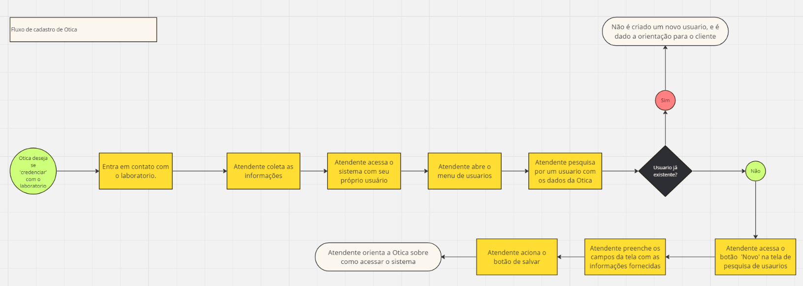
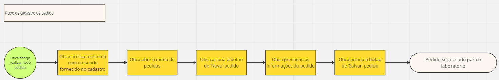
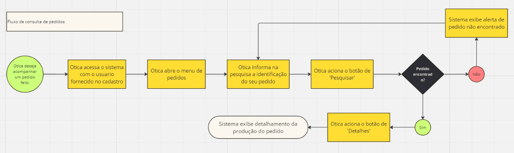
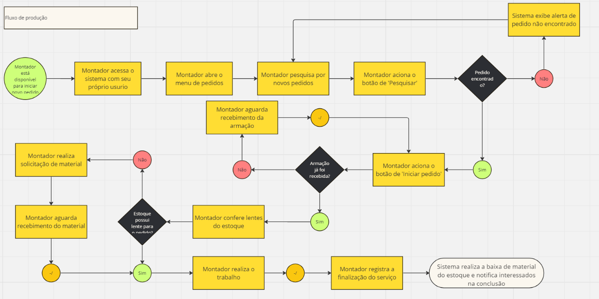

# Projeto de Interface

## Diagrama de Fluxo

Fluxo de Cadastro de Otica

Fluxo de Cadastro de pedidos

Fluxo de Consulta de pedidos

Fluxo de Produção de pedidos

## Wireframes

A estrutura padrão presente nas telas é descrita em detalhes a seguir:

#### Tela - HomePage/login

A tela HomePage/login será a tela inicial do usuário ao acessar a página. Nesta tela haverá o logo do projeto. É nesta tela que o usuário fará o login para acessar sua conta, ou então, redefinir sua senha.

#### Tela - Menu e acompanhamento de pedidos

Nessa tela é possível selecionar as telas de produto, pedidos, relatórios e usuários. Além de poder acompanhar os pedidos em andamento na lateral esquerda.

#### Telas - Cadastro de produtos, pedidos e usuários

Nessa tela é possível cadastrar e atualizar novos produtos.

#### Telas de gestão de produtos, pedidos e usuários

Nessa tela é possível atualizar ou excluir pedidos, produtos ou usuários.

#### Tela de detalhes de pedidos

Nessa tela é possível pesquisar por pedidos e fazer alterações do status do pedido.

### Tela de relatórios

Nessa tela é possível fazer o download dos relatórios de estoque na visão diária, semanal ou mensal. 

 

